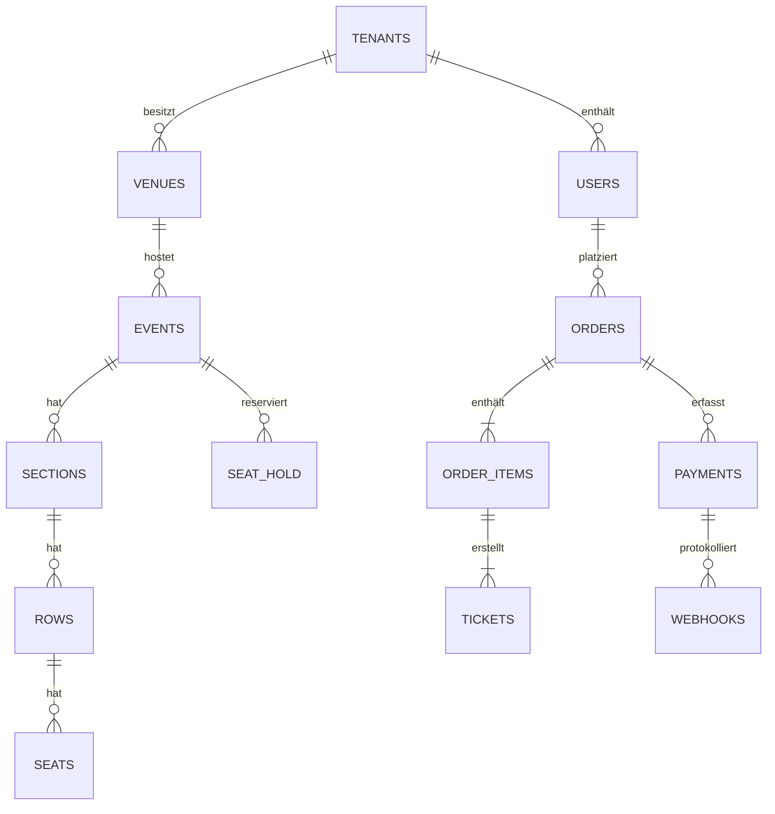

# EventFlow – Ticketing- & Sitzplatzreservierungsplattform

## 1. Zusammenfassung
Ein Greenfield-Webprojekt zum Aufbau einer mandantenfähigen **Ticketing- & Sitzplatzreservierungsplattform** für Veranstaltungsorte und unabhängige Organisatoren.  
Das System umfasst die Erstellung von Events, Sitzplanbearbeitung, Preisstufen, Zahlungen/Webhooks, QR-basierten Eintritt sowie Echtzeit-Verfügbarkeit, um Doppelbuchungen zu verhindern.

**Zeitraum** : Jan 2025 – Apr 2025 (4 Monate)

> **Hinweis**: Alle Daten, Namen und Screenshots in diesem Dokument sind **vollständig anonymisiert** und **Dummy**. Diese Portfolio-Seite dient nur zu Demonstrationszwecken.

---

## 2. Gelöste Probleme

**Fragmentierte Arbeitsabläufe und häufige Überbuchungen aufgrund manueller Sitzplatzverwaltung.**

##### 1) Manuelle Sitzplatzzuweisung
- Organisatoren nutzten Tabellen und Telefon/E-Mail zur Sitzbestätigung.  
- Ergebnis: Doppelbuchungen, langsame Aktualisierungen und schlechte Kundenerfahrung.

##### 2) Uneinheitliche Zahlungsabwicklung
- Kein einheitliches Payment-Gateway oder Webhook-Processing.  
- Ergebnis: Rückerstattungen/Chargebacks waren fehleranfällig, Abgleich erfolgte manuell.

##### 3) Keine Echtzeit-Verfügbarkeit über alle Kanäle
- Tickets wurden auf mehreren Kanälen ohne zentrale Quelle verkauft.  
- Ergebnis: Sitzplatzkonflikte und Support-Tickets.

---

## 3. Meine Rolle & Verantwortlichkeiten

Als **Full-Stack-Webentwickler** habe ich End-to-End-Funktionalitäten über Frontend, Backend und DevOps geliefert.

- **Frontend (Web-App)**
  - Next.js 14 (App Router), Server Components + ISR für SEO-freundliche Landing Pages.
  - State mit Zustand; Formularhandling mit React Hook Form; UI mit TailwindCSS + Headless UI.
  - Sitzplan-Editor mit Canvas (Pan/Zoom, Sektion/Zeilen/Sitz-Werkzeuge).

- **Backend (API & Services)**
  - NestJS + PostgreSQL (Prisma) für mandantenfähige REST/GraphQL-APIs.
  - Redis-basierte Reservierungs-Hold-Queue mit TTL (gegen Überbuchungen).
  - Zahlungsintegration mit Stripe (Checkout + Webhooks), idempotente Handler, signierte Events.
  - E-Mail-/SMS-Benachrichtigungen über Transaktionsprovider.

- **Sicherheit & Auth**
  - OAuth 2.0 / OpenID Connect für Organisatoren; JWT für Client-Apps.
  - RBAC (Owner/Admin/Staff), signierte QR-Codes für Tickets, Rate Limits.

- **DevOps**
  - Dockerisierte Services; GitHub Actions für CI (Build/Test/Lint) und CD.
  - Observability mit strukturierten Logs und Request Tracing.

---

## 4. Tech Stack

- **Frontend**: Next.js 14, React 18, TailwindCSS, Zustand, React Hook Form  
- **Backend**: NestJS, Node.js, Prisma, PostgreSQL, Redis  
- **Zahlungen**: Stripe Checkout, Webhooks, Idempotency Keys  
- **Infrastruktur**: Docker, GitHub Actions, Nginx (Reverse Proxy)  
- **Sonstiges**: Zod (Validierung), JWT, QR-Code (Ticket-Check-in)

---

## 5. Systemarchitektur

**Echtzeit-Sitzplatzsperre** + **ereignisgesteuerte Zahlungen**:

- Client fordert Sitzblock an → API legt einen **Hold** in Redis mit TTL an.  
- Beim Checkout: Stripe-Zahlung → **Webhook** bestätigt → Bestellung & Tickets in Postgres finalisiert.  
- Pro Ticket wird ein QR-Code generiert; die Check-in-App überprüft Signatur und Status.

---

## 6. Datenbank (ERD-Snapshot)

Wichtige Entitäten und Beziehungen für einen Mandanten:

- `users` (Organisator/Staff), `venues`, `events`  
- `sections`, `rows`, `seats`  
- `seat_hold` (TTL), `orders`, `order_items`, `tickets`  
- `payments`, `webhooks` (Audit)  
- `tenants`, `roles`, `permissions`

> Das ERD ist vereinfacht und verwendet Dummy-Bezeichnungen.

---

## 7. Funktions-Highlights

- **Organizer Console**
  - Events erstellen, Branding hochladen, Preisstufen konfigurieren, Zeitpläne steuern.  
  - Drag-and-Drop **Sitzplan-Editor** mit Snapping und Multi-Select.  
  - Massenoperationen: Sitze importieren, Preise im Batch ändern.

- **Customer Flow**
  - Echtzeit-Sitzverfügbarkeit & Countdown-Hold-Timer.  
  - Sicherer Checkout via Stripe; Belege und Ticket-E-Mails.

- **Check-in-App**
  - PWA mit Offline-Cache und **QR-Scanning**.  
  - Signierte Ticketvalidierung; rollenbeschränkte Overrides.

- **Admin & Reporting**
  - Umsatz- und Teilnehmer-Dashboards, Auszahlungsübersichten.  
  - Exportierbare CSVs für Buchhaltung & CRM.

Screens (Dummy):  
-   
-   
-   
-   

---

## 8. Ergebnisse

- **Verhinderung von Überverkäufen**: Redis-TTL-Holds reduzierten Doppelbuchungen auf ~0,1%.  
- **Zahlungszuverlässigkeit**: Idempotente Webhook-Handler eliminierten doppelte Bestellungen.  
- **Performance**: P95-API-Latenz < 120 ms bei Spitzenverkäufen.  
- **DevEx**: CI-Pipeline verkürzte Release-Zeit von Stunden auf Minuten.  

---

## 9. Zukünftige Verbesserungen

- Dynamische Preisregeln (Surge-/Rabattstufen).  
- Anti-Bot-Schutz mit Geräte-Fingerprinting + Rate Limiting.  
- Self-Serve Embeds für Partnerseiten (JS SDK).  
- Event-Klonen & Vorlagen für schnelleres Onboarding.  

---

## 10. Haftungsausschluss

Alle Namen, Daten, Bilder und Diagramme sind Platzhalter, die zu Demonstrationszwecken erstellt wurden.  
Sie spiegeln **keine realen Kunden, Arbeitgeber oder Produktivsysteme** wider.
