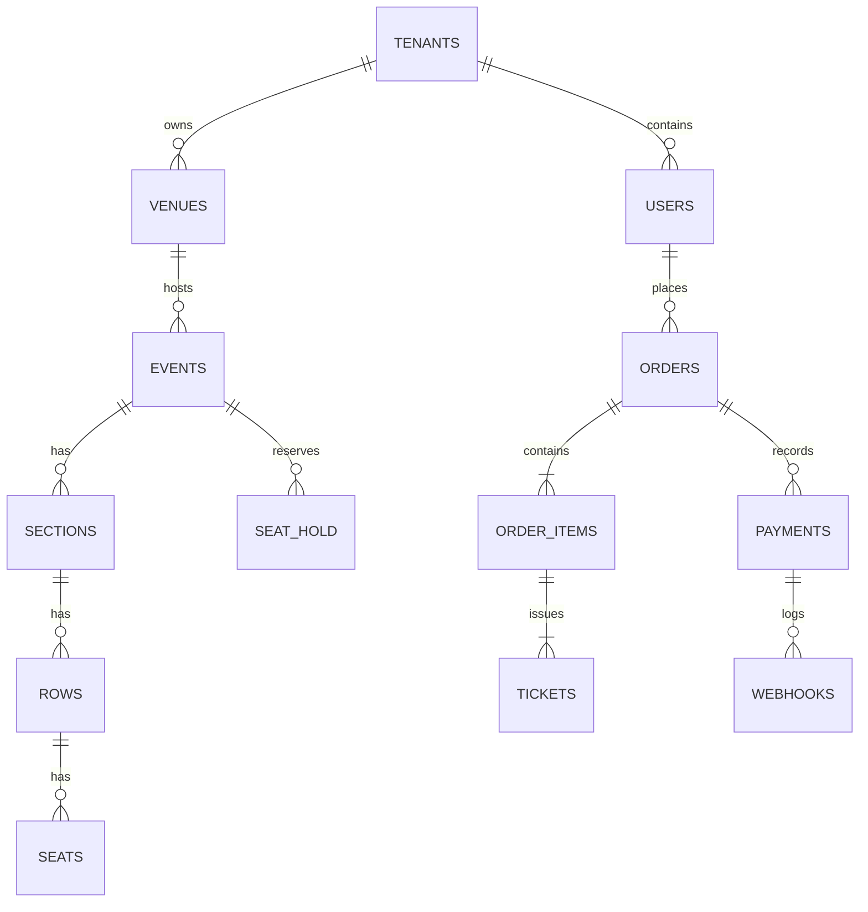

# EventFlow – Ticketing & Seat Reservation Platform

## 1. Summary
A greenfield web project to build a multi-tenant **ticketing & seat reservation** platform for venues and independent organizers. The system covers event creation, seat‑map editing, tiered pricing, payments/webhooks, QR‑based entry, and real‑time availability to prevent double bookings.

**Period** : Jan 2025 – Apr 2025 (4 Months)

> **Note**: All data, names, and screenshots in this document are **fully anonymized** and **dummy**. This portfolio page is for demonstration only.

---

## 2. Problems We Solved

**Fragmented workflow and frequent overbooking due to manual seat control.**

##### 1) Manual seat assignment
- Organizers used spreadsheets and phone/email to confirm seats.
- Result: double bookings, slow updates, and poor customer experience.

##### 2) Inconsistent payment handling
- No unified payment gateway or webhook processing.
- Result: refunds/chargebacks were error‑prone and reconciliation was manual.

##### 3) No real‑time availability across channels
- Tickets sold on multiple channels without an authoritative source.
- Result: seat conflicts and support tickets.

---

## 3. My Role & Responsibilities

As a **Full‑Stack Web Engineer**, I delivered end‑to‑end features across frontend, backend, and DevOps.

- **Frontend (Web App)**
  - Next.js 14 (App Router), server components + ISR for SEO‑friendly landing pages.
  - State with Zustand; form handling with React Hook Form; UI with TailwindCSS + Headless UI.
  - Seat‑map editor with canvas (pan/zoom, section/row/seat tools).

- **Backend (API & Services)**
  - NestJS + PostgreSQL (Prisma) for multi‑tenant REST/GraphQL APIs.
  - Redis‑based reservation hold queue with TTL (anti overbooking).
  - Payment integrations with Stripe (Checkout + Webhooks), idempotent handlers, signed events.
  - Email/SMS notifications via transactional providers.

- **Security & Auth**
  - OAuth 2.0 / OpenID Connect for organizers; JWT for client apps.
  - RBAC (owner/admin/staff), signed QR for tickets, rate limits.

- **DevOps**
  - Dockerized services; GitHub Actions for CI (build/test/lint) and CD.
  - Observability with structured logs and request tracing.

---

## 4. Tech Stack

- **Frontend**: Next.js 14, React 18, TailwindCSS, Zustand, React Hook Form
- **Backend**: NestJS, Node.js, Prisma, PostgreSQL, Redis
- **Payments**: Stripe Checkout, Webhooks, Idempotency Keys
- **Infra**: Docker, GitHub Actions, Nginx (reverse proxy)
- **Other**: Zod (validation), JWT, QR code (ticket check‑in)

---

## 5. System Architecture

**Real‑time seat locking** + **event‑driven payments**:

- Client requests a seat block → API places a **hold** in Redis with TTL.
- On checkout, Stripe completes payment → **Webhook** confirms → order & tickets finalized in Postgres.
- QR codes are generated per ticket; the check‑in app verifies signature and status.

---

## 6. Database (ERD Snapshot)

Key entities and relationships for a single tenant:

- `users` (organizer/staff), `venues`, `events`
- `sections`, `rows`, `seats`
- `seat_hold` (TTL), `orders`, `order_items`, `tickets`
- `payments`, `webhooks` (audit)
- `tenants`, `roles`, `permissions`

> ERD is simplified for demonstration and uses dummy naming.

---

## 7. Feature Highlights

- **Organizer Console**
  - Create events, upload branding, configure tiers/prices, control schedules.
  - Drag‑and‑drop **Seat‑Map Editor** with snapping and multi‑select.
  - Bulk operations: import seats, batch price changes.

- **Customer Flow**
  - Real‑time seat availability & countdown hold timer.
  - Secure checkout via Stripe; receipts and ticket emails.

- **Check‑in App**
  - PWA with offline cache and **QR scanning**.
  - Signed ticket validation; role‑restricted override.

- **Admin & Reporting**
  - Revenue and attendance dashboards, payout summaries.
  - Exportable CSVs for accounting & CRM.

Screens (dummy):
- 
- 
- 
- 

---

## 8. Achievements

- **Oversell Prevention**: Redis TTL holds reduced double bookings to ~0.1%.
- **Payment Reliability**: Idempotent webhook handlers eliminated duplicate order creation.
- **Performance**: P95 API latency under 120 ms on peak sale events.
- **DevEx**: CI pipeline cut release time from hours to minutes.

---

## 9. Future Improvements

- Dynamic pricing rules (surge/discount bands).
- Anti‑bot protection with device fingerprinting + rate limiting.
- Self‑serve embeds for partner sites (JS SDK).
- Event cloning & templating for faster organizer onboarding.

---

## 10. Disclaimer

All names, data, images, and diagrams are placeholders created for portfolio demonstration. They **do not** reflect any real clients, employers, or production systems.
